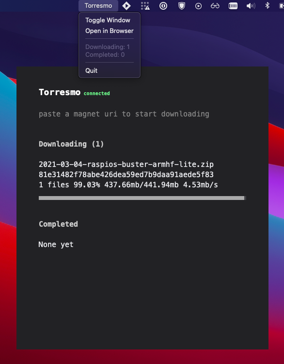

# Torresmo

[](https://godoc.org/github.com/mvrilo/torresmo)
[](https://goreportcard.com/report/github.com/mvrilo/torresmo)

Torresmo is an experimental Torrent client and server built with Go.

## Features

- Single binary deploy
- Bultin HTTP server
- Websocket support
- Embedded web interface (using esbuild, TypeScript and Preact)
- Initial GUI support (mac only for now, using [macdriver](https://github.com/progrium/macdriver))
- Server discovery via mDNS



## Build

Requirements:

- Go 1.16

```
make torresmo
```

## Usage

```
Torresmo torrent client and server

Usage:
  torresmo [command]

Available Commands:
  discover    Discover Torresmo servers in the network
  help        Help about any command
  server      Torresmo torrent client and server
  version     Torresmo version

Flags:
  -h, --help      help for torresmo
  -v, --version   version for torresmo
```

Server usage:

```
Torresmo torrent client and server

Usage:
  torresmo server [flags]

Flags:
  -a, --addr string             HTTP Server address (default ":8000")
  -b, --biggest                 Prioritize the biggest file in the torrent (default true)
  -d, --debug                   Enable seeding (default true)
  -c, --discovery               Enable mDNS discovery (default true)
  -D, --download-limit int      Download limit
  -g, --gui                     Runs graphical interface (default true)
  -h, --help                    help for server
  -p, --open                    Open service address in the browser
  -o, --out string              Output directory (default "downloads")
  -s, --seed                    Enable seeding (default true)
  -e, --serve                   Serve downloaded files (default true)
  -t, --torrent-files string    Directory to dump torrent files (default "downloads/.torrents")
  -U, --upload-limit int        Upload limit
  -w, --watch-torrents string   Directory for new torrents, once added it will start download (default "downloads/.torrents")

```

## License

MIT
