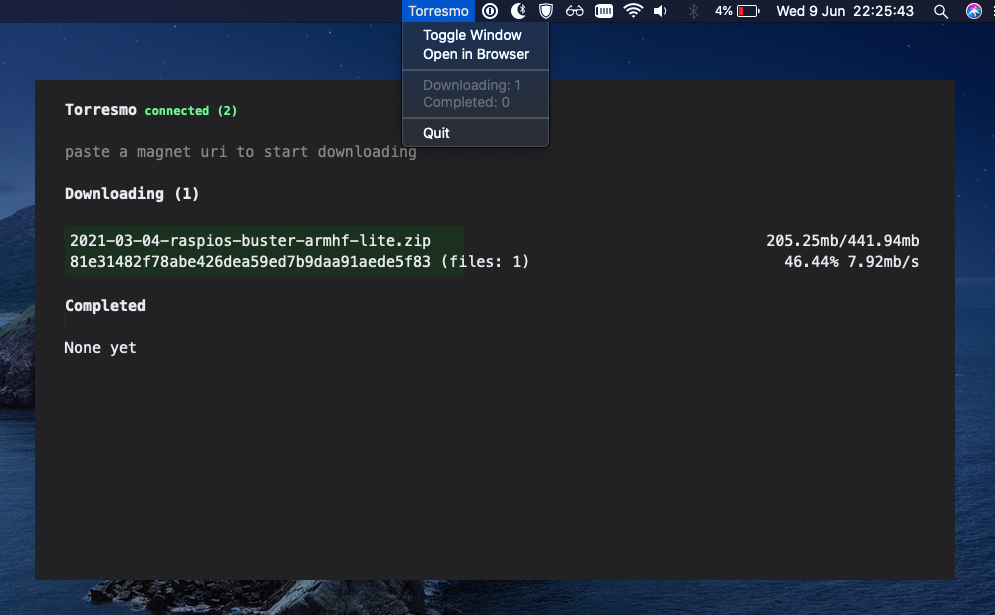

# Torresmo

[](https://godoc.org/github.com/mvrilo/torresmo)
[](https://goreportcard.com/report/github.com/mvrilo/torresmo)

Torresmo is a highly experimental and tasty torrent client built with Go.

## Features

- single binary
- mac app build
- http server and rest api
- websocket events
- embedded web interface (using esbuild, typescript and preact)
- graphical interface (mac only for now, via macdriver)

## Build

Go binary:

```
make torresmo
```

Mac app:

```
make mac
```

## Usage

```
$ ./torresmo server -h
Torresmo torrent client and server

Usage:
  torresmo server [flags]

Flags:
  -a, --addr string          HTTP Server address (default ":8000")
  -b, --biggest              Prioritize the biggest file in the torrent (default true)
  -d, --debug                Enable seeding (default true)
  -D, --download-limit int   Download limit
  -g, --gui                  Runs graphical interface (default true)
  -h, --help                 help for server
  -o, --out string           Output directory (default "downloads")
  -s, --seed                 Enable seeding (default true)
  -U, --upload-limit int     Upload limit
  -w, --watch string         Watch torrents in this directory (default "downloads")
```

## Example


